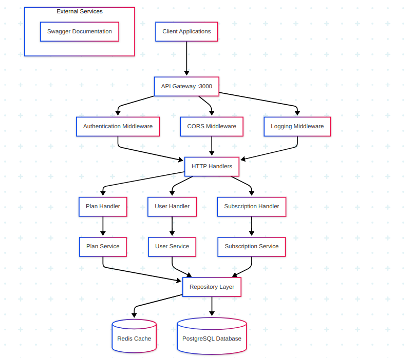

# Subscription Management Service

A high-performance, scalable microservice for managing user subscriptions built with Go, featuring Redis caching, JWT authentication, and comprehensive API documentation.

**Note**: The `.env` is dummy but will work fine for local testing and development using `docker`.

## Table of Contents

- [Architecture Overview](#architecture-overview)
- [Tech Stack](#tech-stack)
- [Features](#features)
- [Performance Metrics](#performance-metrics)
- [API Endpoints](#api-endpoints)
- [Data Models](#data-models)
- [Setup Instructions](#setup-instructions)
- [API Usage with Postman](#api-usage-with-postman)
- [Configuration](#configuration)


## Architecture Overview

The service follows a clean architecture pattern with clear separation of concerns:



### Layer Responsibilities

- **Handler Layer**: HTTP request/response handling, input validation
- **Service Layer**: Business logic implementation, data processing
- **Repository Layer**: Data access abstraction, caching strategies
- **Middleware Layer**: Cross-cutting concerns (auth, logging, CORS)

## Tech Stack

| Component | Technology | Purpose |
|-----------|------------|---------|
| **Language** | Go | High-performance backend development |
| **Web Framework** | Fiber | Fast HTTP web framework |
| **Database** | PostgreSQL | Primary data storage (Dockerized) |
| **ORM** | GORM | Object-relational mapping |
| **Cache** | Redis | High-speed data caching |
| **Authentication** | JWT | Stateless authentication |
| **Validation** | go-playground/validator | Input validation |
| **Logging** | Logrus | Structured logging |
| **Migration** | golang-migrate/migrate | Database schema management |
| **Documentation** | Swaggo/Swag | API documentation generation |
| **Environment** | godotenv | Configuration management |
| **Retry Logic** | go-retry | Fault tolerance |

## Features

### Functional Requirements
- ✅ User subscription management
- ✅ Subscription lifecycle (create, read, update, cancel)
- ✅ Plan management and retrieval
- ✅ Subscription upgrades/downgrades
- ✅ User registration and authentication

### Non-Functional Requirements
- ✅ Microservice architecture
- ✅ Comprehensive error handling and input validation
- ✅ Retry mechanism for fault tolerance
- ✅ Low latency with Redis caching
- ✅ Data encryption and security
- ✅ High availability and scalability

## Performance Metrics

### Cache Performance
- **Without Redis**: ~315ms average response time
- **With Redis**: ~2ms average response time
- **Performance Improvement**: 99.4% reduction in lookup times

### Verification
Test the performance improvement by hitting the `/api/plans/plans` endpoint and monitoring response times.

## API Endpoints

### Base URL
```
http://localhost:3000
```

### Available Endpoints

| Method | Endpoint | Description | Authentication |
|--------|----------|-------------|----------------|
| GET | `/swagger/index.html` | API Documentation | None |
| GET | `/api/plans/plans` | Retrieve all subscription plans | None |
| POST | `/api/user/register` | Register new user | None |
| POST | `/api/subs/subscription/:planId` | Create subscription | Bearer Token |
| GET | `/api/subs/subscription` | Get user subscription | Bearer Token |
| PUT | `/api/subs/subscription/:planId` | Update subscription plan | Bearer Token |
| DELETE | `/api/subs/subscription` | Cancel subscription | Bearer Token |

### Response Format
All API responses follow a consistent structure:
```json
{
  "data": {
    // Response payload
  },
  "error": null
}
```

## Data Models

### Plan Model
```go
type Plan struct {
    ID            uint           `json:"id"`
    Name          string         `json:"name"`
    Price         float64        `json:"price"`
    Features      datatypes.JSON `json:"features"`
    Duration      int            `json:"duration_days"`
    CreatedAt     time.Time      `json:"created_at"`
    UpdatedAt     time.Time      `json:"updated_at"`
    Subscriptions []Subscription `json:"-"`
}
```

### User Model
```go
type User struct {
    ID           uint         `json:"id"`
    Name         string       `json:"name"`
    Password     string       `json:"-"`
    CreatedAt    time.Time    `json:"created_at"`
    UpdatedAt    time.Time    `json:"updated_at"`
    Subscription Subscription `json:"subscription"`
}
```

### Subscription Model
```go
type Subscription struct {
    ID        uint               `json:"id"`
    UserID    uint               `json:"user_id"`
    PlanID    uint               `json:"plan_id"`
    Status    SubscriptionStatus `json:"status"`
    StartDate time.Time          `json:"start_date"`
    EndDate   time.Time          `json:"end_date"`
    CreatedAt time.Time          `json:"created_at"`
    UpdatedAt time.Time          `json:"updated_at"`
}
```

## Setup Instructions

### Prerequisites
- Docker and Docker Compose
- Git

### Installation

1. **Clone the repository**
   ```bash
   git clone https://github.com/Harshal292004/subscription-service
   cd subscription-service
   ```

2. **Start the services**
   ```bash
   docker compose up --build
   ```

3. **Verify installation**
   Navigate to `http://localhost:3000/swagger/index.html` to access the API documentation.

### Environment Configuration
Create a `.env` file in the root directory:
```env
POSTGRES_DB=subscription_db
POSTGRES_USER=postgres
POSTGRES_PASSWORD=postgres
POSTGRES_PORT=5432
POSTGRES_HOST=postgres
POSTGRES_SSLMODE=disable

ADDR=redis:6379
REDIS_PASSWORD=redis
REDIS_DB=0
REDIS_PROTOCOL=2

JWT_SECRET=secret
```

## API Usage with Postman

### 1. Get Available Plans
```http
GET http://localhost:3000/api/plans/plans
Content-Type: application/json
```

**Expected Response:**
```json
{
  "data": [
    {
      "id": 1,
      "name": "Basic Plan",
      "price": 9.99,
      "features": ["Feature A", "Feature B"],
      "duration_days": 30,
      "created_at": "2025-05-30T09:48:00.965857Z",
      "updated_at": "2025-05-30T09:48:00.965857Z"
    }
  ]
}
```

### 2. User Registration
```http
POST http://localhost:3000/api/user/register
Content-Type: application/json

{
  "name": "John Doe",
  "password": "securepassword123"
}
```

**Expected Response:**
```json
{
  "token": "eyJhbGciOiJIUzI1NiIsInR5cCI6IkpXVCJ9..."
}
```

### 3. Create Subscription
```http
POST http://localhost:3000/api/subs/subscription/1
Authorization: Bearer <jwt_token>
Content-Type: application/json

{
  "planId": 1
}
```

**Expected Response:**
```json
{
  "data": {
    "id": 1,
    "user_id": 1,
    "plan_id": 1,
    "Status": "ACTIVE",
    "start_date": "2025-05-30T10:17:30.72206493Z",
    "end_date": "2025-06-29T10:17:30.72206493Z",
    "created_at": "2025-05-30T10:17:30.722121753Z",
    "updated_at": "2025-05-30T10:17:30.722121753Z"
  }
}
```

### 4. Get User Subscription
```http
GET http://localhost:3000/api/subs/subscription
Authorization: Bearer <jwt_token>
```

### 5. Update Subscription Plan
```http
PUT http://localhost:3000/api/subs/subscription/2
Authorization: Bearer <jwt_token>
```

### 6. Cancel Subscription
```http
DELETE http://localhost:3000/api/subs/subscription
Authorization: Bearer <jwt_token>
```

**Expected Response:**
```json
{
  "data": {
    "id": 1,
    "user_id": 1,
    "plan_id": 1,
    "Status": "EXPIRED",
    "start_date": "2025-05-30T10:17:30.72206493Z",
    "end_date": "2025-06-29T10:17:30.72206493Z",
    "created_at": "2025-05-30T10:17:30.722121753Z",
    "updated_at": "2025-05-30T10:17:30.722121753Z"
  }
}
```

## Configuration

### Retry Mechanism
The service implements exponential backoff retry logic using go-retry for:
- Database connection failures
- Redis cache misses
- External service calls

### Security Features
- JWT-based authentication
- Password hashing using bcrypt
- Input validation and sanitization
- CORS protection
- Request rate limiting

### Monitoring and Logging
- Structured logging with Logrus
- Request/response logging middleware
- Performance metrics tracking
- Error tracking and reporting


### API Documentation
The API documentation is automatically generated using Swagger annotations and is available at `/swagger/index.html` when the service is running.


## License

This project is licensed under the MIT License - see the [LICENSE](LICENSE) file for details.